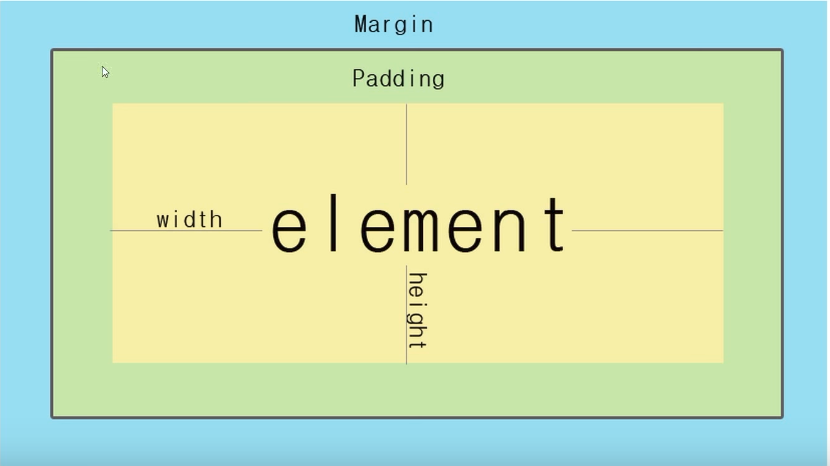
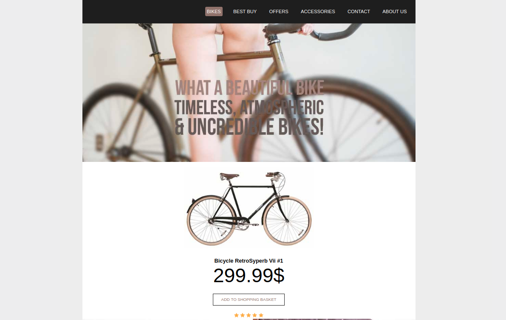

# code-css3

learning css

---

## selector

1. css 引入方式： inline,embedded,external
   1.1 注意 default browsers css style
2. id 在 page 中是唯一的，class 可以多次使用
3. Inheritance 层次嵌套，conflicts 冲突,权重(override)

   ```
   id(100points)>class(10points)>element(1points)
   ```

4. [`descendants(后代)与 direct child`](./selector)

   ```css
   /* 所有后代 */
   #main p {
     color: red;
   }
   /* 直接 child */
   #main > p {
     color: red;
   }
   ```

5. 属性值 !important,覆盖

   ```css
   color: red !important;
   ```

6. descendants(嵌套 所有后代),direct child(嵌套 直接后代)

   ```css
   #main p {
   }
   #main > p {
   }
   ```

7. multiple elements have one(same) css style rule

   ```
    p,span,a,li{}
   ```

8. adjacent selector

   ```css
   #all-articles h2 + p {
   }
   ```

9. attribute selector

   ```css
    span[title]{}
    /*more specific*/
    span[title="google"]
   ```

   9.1 multiple class

   ```html
   <span class="deck halls"></span>
   <!-- css  选择class都是deck的span-->
   span[class~="deck"]
   ```

   9.2 特殊符号

   ```css
   /*以属性开头*/
   a[href^="http"] {
   }
   /*以属性结尾*/
   a[href$=".pdf"] {
   }
   ```

10. Pseudo selectors

    ```css
     selector:keyword{
     declaration
     }
    ```

    10.2 keyword: **hover**,**active**,**visited**
    10.3 first & last child selector

    ```css
    /*选择article下的第一个p标签*/
    article p:first-child {
    }
    /*选择article下的最后一个p标签*/
    article p:last-child {
    }
    ```

    10.4 first & last of type selector(类型指的是标签类型)

    ```css
    /* article h1 p 在嵌套中，h1在中间*/
    article p:first-of-type {
    }
    article p:last-of-type {
    }
    ```

    10.5 nth child selector

    ```css
    /*数字*/
    ul: nth-child(2) {

    }
    /*关键字 even odd*/
    ul: nth-child(even) {

    }
    /*公式，n从0开始，默认递增1*/
    ul:nth-child(2n + 1) {
    }
    ```

    10.6 nth of type selector

    ```css
    /*usege like nth-child*/
    article: nth-of-type(2);
    ```

11. combining selectors

    ```css
    /*标签都使用同一个class名称的情况，注意没有空格*/
    article.featured-content {
    }
    div.featured-content {
    }
    ```

12. universal selector 可以 override 浏览器的默认的样式
    ```css
    * {
    }
    ```

> finished selector part

---

## style

1. font-size.

   ```css
   /*absolute size*/
   font-size: 40px;

   /*inherit(父节点,上面样式的样式) relative size*/
   font-size: 4em; /*4倍*/
   font-size: 50%;
   ```

2. font-family 字体

   ```css
   font-family: arial;
   ```

3. font-weight 颜色深度

   ```css
   font-weight: bold;
   ```

4. text-decoration 下划线，划线

5. text-transform 大小写，单词开头字母大写（capitalize）

6. text color

   ```css
   color: red;
   background-color: black;
   ```

7. letter spacing | word spacing | line height
   ```css
   letter-spacing: 2px;
   word-spacing: 2px;
   line-height: 2px;
   ```
8. paragraph spacing

   ```css
   /*用margin来实现*/
   margin-bottom: 32px;
   ```

9. The Box Model
   

10. margin ，padding（一样）

    ```css
    /*4 个参数*/
    margin: top right bottom left；
    /*3个参数*/
    margin: top (right left) bottom;
    /*2个参数*/
    margin: (top bottom) (right left)；
    /*1个参数*/
    margin: represent all;

    /*auto 属性 center*/
    margin: 30px auto;
    ```

    > 注意： margin-bottom 与另外一个 margin-top 不上下叠加，只会取其中最大值。

    > width: 100% 问题（margin 与 padding 会额外加进去）

11. border

    ```css
    border-top-width: 10px;
    border-top-style: solid;
    border-top-color: red;

    /*简写*/
    border-top: 10px solid red;

    /*四周边框*/
    border: 10px solid red;
    ```

12. [`block level elements & inline elements`](https://www.w3resource.com/html/HTML-block-level-and-inline-elements.php)(是否是另起一行)

    > inline elements stack side by side.

    ```css
    /*div 是属于block*/
    /*a span是属于inline*/
    display: inline-block; /*在inline中设置block 如导航*/
    ```

13. width and height 数字 px，%；

14. Rounded corners

    ```css
    .circle {
      width: 100px;
      height: 100px;
      border-radius: 50%;
      background-color: brown;
    }
    ```

15. background

    ```css
    background-imgs: url();
    /*round属性,图片会自动分布，不会出现超出边界截图的情况*/
    background-repeat: no-repeat;
    background-position: center;

    /*简写*/
    background: url() np-repeat center;

    background-size: 200px;
    ```

    multiple backgrounds(一个图片做背景，一个是 logo)

    ```css
    background-img: url(), url();
    background-repeat: np-repeat;
    background-position: center, top left;
    background-size: 300px, 100%;
    ```

16. opacity 透明度对所有都生效，rgba()只对背景颜色

17. text-align 不仅对使用文字，对图片也生效

18. gradient 颜色渐变

15) [`Box shadow online design网站`](https://www.cssmatic.com/box-shadow)

---

## final easy website

- [访问链接](https://q10viking.github.io/test/)



## videos

[youtube-CSS Tutorial For Beginners](https://www.youtube.com/watch?v=MlJrAhGVIis&list=PL4cUxeGkcC9gQeDH6xYhmO-db2mhoTSrT&index=16)

[火狐 css 官网指南](https://developer.mozilla.org/zh-CN/docs/Web/CSS/background)
